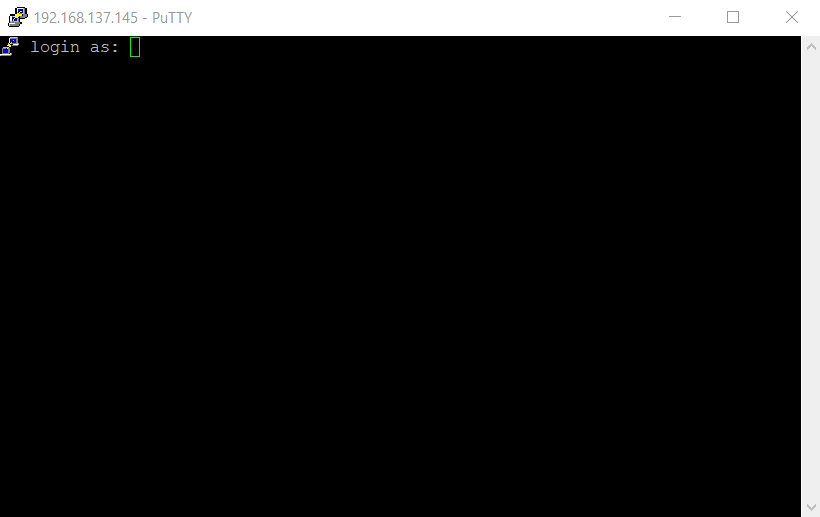
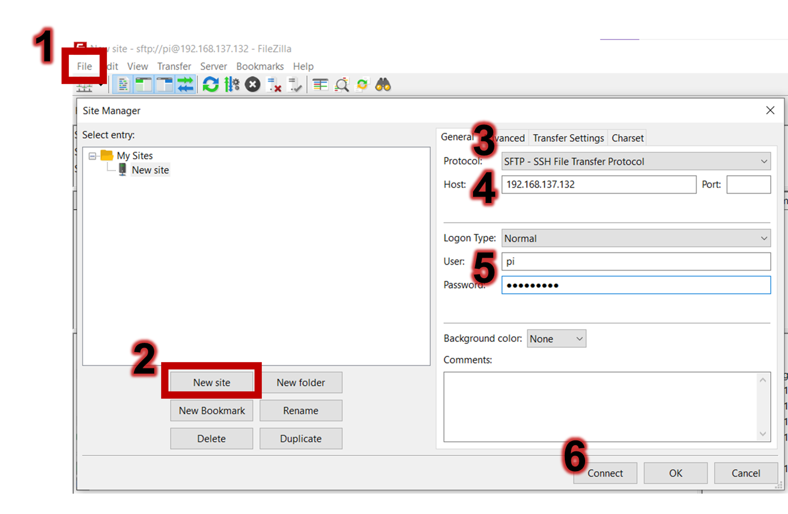
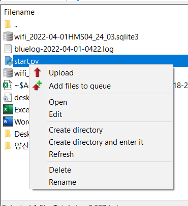

# How to build a sensor

## Getting started with Pi

### Step 1: Install the OS of Pi on your SD card {-}
1. Plug in your SD card on your laptop and open the Raspberry OS imager and `format` your SD card.  


2. Write the Raspberry Pi OS on your SD card. Please enable `ssh` and set username (pi) and password (raspberry) in the setting before the writing.  


---

### Step 2: Connect the Pi on your laptop {-}
This enables your laptop to access and control your Pi via *a network cable*. We don't need to buy and use a screen, keyboard and mouse that can be attached to the Pi.
<<<<<<< HEAD

1. Plug in your SD card on the Pi and connect the Pi on your laptop via a Ethernet cable.  


2. Enable `internet connection sharing option` on your WiFI adapter.  


3. Find and remember the `IP address of your Pi`. 1) Press the window key button; 2) type in `cmd`, 3) type in `arp -a`, 4) search the IP address of Raspberry Pi by looking the first 6 characters of physical address

    > MAC Address Lookup: MAC addresses of the all devices of Raspberry Pi Foundation start with `B8:27:EB:xx:xx:xx` or `DC:A6:32:xx:xx:xx`.  

    

4. Access your Pi by Putty by typing the IP address in the host name.  


5. Log in your Pi with the default setting (ID: pi, password: raspberry). Type `ping 8.8.8.8` to see if your Pi can use the Internet.  


### Step 3: Set up your Pi {-}
1. Update your Pi and packages:
    ```{console}
    sudo apt-get update -y && sudo apt-get upgrade -y
    ```

2. Install packages we use:
    ```{console}
    sudo apt-get install git python3-pip python3-dpkt python3-pcapy python3-schedule python3-picamera python3-dropbox libbluetooth-dev -y    
    ```

3. Set up the wireless setting on your phone hot spot 
    ```{console}
    sudo nano /etc/wpa_supplicant/wpa_supplicant.conf    
    ```
    - Put your mobile hot spot information (to me, *juhyeon9087* for both SSID and password)
    ```{console}
    country=GB
    network={
     ssid="juhyeon9087"
     psk="juhyeon9087"
     key_mgmt=WPA-PSK
    }
    ```

4. Set up camera by turning on `interface Options` - `Legacy Camera`
    ```{console}
    sudo raspi-config
    ```

5. Set up Dropbox on your Pi.
    - Get your Dropbox access key first
      - Create a app in the developer site of Dropbox [here](https://www.dropbox.com/developers/apps/create)
      - Select access more scopes:  
      Move into `Permissions` and check more access
      
    - Clone this script to the Raspberry Pi
      ```{console}
      git clone https://github.com/andreafabrizi/Dropbox-Uploader.git
      ```
    - Move into the cloned folder:  
      ```{console}
      cd Dropbox-Uploader
      ```
    - Give the `dropbox_uploader.sh` script:  
      ```{console}
      sudo chmod +x dropbox_uploader.sh
      ```
    - Run the `dropbox_uploader.sh` script:  
      ```{console}
      ./dropbox_uploader.sh
      ```
    - Copy and paste your `app key` and `app secret`
    - Cope and paste of the terminal URL to your search engine and put your `access code`
    

## Setting up the Pi to a sensor 


### Step 1: Test and play your your Pi {-}
1. Detecting WiFi packets
    - Plug in a WiFi adapter on your Pi and type this:
    ```{console}
    pi@raspberrypi:~ $ iwconfig
    lo        no wireless extensions.
     
    eth0      no wireless extensions.
     
    wlan0     IEEE 802.11  ESSID:off/any
              Mode:Managed  Access Point: Not-Associated
              Retry short limit:7   RTS thr:off   Fragment thr:off
              Power Management:on
     
    wlan1     IEEE 802.11  ESSID:off/any
              Mode:Managed  Access Point: Not-Associated   Tx-Power=20 dBm
              Retry short  long limit:2   RTS thr:off   Fragment thr:off
              Power Management:off

    ```
    - You will see `wlan1`, which you couldn't see before plugging in. `wlan0` is the onboard WiFi.
    - Install the `aircrack-ng` tool
    ```{console}
    sudo apt-get install -y aircrack-ng
    ```
    - Put the `wlan1` in monitoring mode
    ```{console}
    sudo airmon-ng start wlan1
    ```
    - With the monitoring mode adapter, execute this to scan for nearby WiFi devices
    ```{console}
    sudo airodump-ng wlan1mon
    ```
    

3. Sending a file on your dropbox
    - Move on the `Dropbox-Uploader` folder (`cd ..` is going back to home folder)
    ```{console}
    cd Dropbox-Uploader
    ```
    - Get the list of Dropbox file list
    ```{console}
    root@raspberrypi:/home/pi/Dropbox-Uploader# ./dropbox_uploader.sh list
    > Listing "/"... DONE
    [D]  External Drive.dbx-external-drive
    ```
    - Upload one file on your Dropbox
    ```{console}
    root@raspberrypi:/home/pi/Dropbox-Uploader# ./dropbox_uploader.sh upload README.md /
    > Uploading "/home/pi/Dropbox-Uploader/README.md" to "/README.md"... DONE
    ```
    - Recheck the uploaded file on your Dropbox
    ```{console}
    root@raspberrypi:/home/pi/Dropbox-Uploader# ./dropbox_uploader.sh list
    > Listing "/"... DONE
    [D]      External Drive.dbx-external-drive
    [F] 9373 README.md
    ```

4. Detecting Bluetooth packets
    - Clone a simple Bluetooth packet collector
    ```{console}
    git clone https://github.com/MS3FGX/Bluelog.git   
    ```
    - Move on the folder
    ```{console}
    cd Bluelog
    ```
    - `make` and run the code by typing `./bluelog -vmfn`

5. Take a shot by Pi camera
    - Check the attached camera
    ```{console}
    vcgencmd get_camera    
    supported=1 detected=1
    ```
    - Enter the command:
    ```{console}
    raspistill -o test.jpg
    ```
    
### Step 2: Make our Pi as a sensor {-}
1. Download [Filezlia](https://filezilla-project.org/) and the code [here](./static/file/start.py)

2. Access your Pi by the Filezlia; 1) `file` - `Site Manager`, 2) `New site`, 3) Protoal as `SSH transfer`, 4) Host as your Pi IP, 5) User and Password (pi and raspberry as a default)
  

2. Copy and paste the Python file `start.py` on the Pi.
  


3. Test the python file 
    ```{console}
    python start.py
    ```

4. Make the setting to execute the file after booting autumatically. In root setting (`sudo su`), copy and paste this:
    ```{console}
    echo "[Unit]
    Description=Wifi monitoring service
    After=network.target
    
    [Service]
    WorkingDirectory=/home/pi/
    ExecStart=/usr/bin/python /home/pi/start.py
    User=root
    Group=root
    [Install]
    WantedBy=multi-user.target" > /lib/systemd/system/wifi_monitor.service
    cc
    chmod 644 /lib/systemd/system/wifi_monitor.service
    systemctl daemon-reload
    systemctl enable wifi_monitor.service
    ```
    - Type this if you want to *start* the setting:
    ```{console}
    systemctl start wifi_monitor
    ```
    - Type this if you want to *stop* the setting:
    ```{console}
    systemctl stop wifi_monitor
    ```
    - Type this if you want to *restart* the setting:
    ```{console}
    systemctl restart wifi_monitor
    ```

### Step 3: Understand our sensor procedure {-}
| Time (seconds)                | Function                           | What should you do             |
|-----------------------|------------------------------------|--------------------------------|
| 0 | Before booting | Unplug all </br> Turn on your hot spot |
| 0 ~ 2  | Boot | After 2~3 seconds plug your WiFi adapter |
| 2 ~ 5  | Syncronize the time with network time | You can see Blue light of the adapter </br> You can see RaspberryPi in the hotspot |
| 5 ~ 20  | Camera shot | See Dropbox  |
| 20 ~ 30  | monitoring mode | Blue light off  |
| 30 ~ | Start | | 
=======

1. Plug in your SD card on the Pi and connect the Pi on your laptop via a Ethernet cable.  


2. Enable `internet connection sharing option` on your WiFI adapter.  


3. Find and remember the `IP address of your Pi`. 1) Press the window key button; 2) type in `cmd`, 3) type in `arp -a`, 4) search the IP address of Raspberry Pi by looking the first 6 characters of physical address

    > MAC Address Lookup: MAC addresses of the all devices of Raspberry Pi Foundation start with `B8:27:EB:xx:xx:xx` or `DC:A6:32:xx:xx:xx`.  

    

4. Access your Pi by Putty by typing the IP address in the host name.  


5. Log in your Pi with the default setting (ID: pi, password: raspberry). Type `ping 8.8.8.8` to see if your Pi can use the Internet.  


### Step 3: Set up your Pi {-}
1. Update your Pi and packages:
    ```{console}
    sudo apt-get update -y && sudo apt-get upgrade -y
    ```

2. Install packages we use:
    ```{console}
    sudo apt-get install git python3-pip python3-dpkt python3-pcapy python3-schedule python3-picamera python3-dropbox libbluetooth-dev -y    
    ```

3. Set up the wireless setting on your phone hot spot 
    ```{console}
    sudo nano /etc/wpa_supplicant/wpa_supplicant.conf    
    ```
    - Put your mobile hot spot information (to me, *juhyeon9087* for both SSID and password)
    ```{console}
    country=GB
    network={
     ssid="juhyeon9087"
     psk="juhyeon9087"
     key_mgmt=WPA-PSK
    }
    ```

4. Set up camera by turning on `interface Options` - `Legacy Camera`
    ```{console}
    sudo raspi-config
    ```

5. Set up Dropbox on your Pi.
    - Get your Dropbox access key first
      - Create a app in the developer site of Dropbox [here](https://www.dropbox.com/developers/apps/create)
      - Select access more scopes:  
      Move into `Permissions` and check more access
      
    - Clone this script to the Raspberry Pi
      ```{console}
      git clone https://github.com/andreafabrizi/Dropbox-Uploader.git
      ```
    - Move into the cloned folder:  
      ```{console}
      cd Dropbox-Uploader
      ```
    - Give the `dropbox_uploader.sh` script:  
      ```{console}
      sudo chmod +x dropbox_uploader.sh
      ```
    - Run the `dropbox_uploader.sh` script:  
      ```{console}
      ./dropbox_uploader.sh
      ```
    - Copy and paste your `app key` and `app secret`
    - Cope and paste of the terminal URL to your search engine and put your `access code`
    

### Step 4: Test and play your your Pi {-}
1. Detecting WiFi packets
    - Plug in a WiFi adapter on your Pi and type this:
    ```{console}
    pi@raspberrypi:~ $ iwconfig
    lo        no wireless extensions.
     
    eth0      no wireless extensions.
     
    wlan0     IEEE 802.11  ESSID:off/any
              Mode:Managed  Access Point: Not-Associated
              Retry short limit:7   RTS thr:off   Fragment thr:off
              Power Management:on
     
    wlan1     IEEE 802.11  ESSID:off/any
              Mode:Managed  Access Point: Not-Associated   Tx-Power=20 dBm
              Retry short  long limit:2   RTS thr:off   Fragment thr:off
              Power Management:off

    ```
    - You will see `wlan1`, which you couldn't see before plugging in. `wlan0` is the onboard WiFi.
    - Install the `aircrack-ng` tool
    ```{console}
    sudo apt-get install -y aircrack-ng
    ```
    - Put the `wlan1` in monitoring mode
    ```{console}
    sudo airmon-ng start wlan1
    ```
    - With the monitoring mode adapter, execute this to scan for nearby WiFi devices
    ```{console}
    sudo airodump-ng wlan1mon
    ```
    

3. Sending a file on your dropbox
    - Move on the `Dropbox-Uploader` folder (`cd ..` is going back to home folder)
    ```{console}
    cd Dropbox-Uploader
    ```
    - Get the list of Dropbox file list
    ```{console}
    root@raspberrypi:/home/pi/Dropbox-Uploader# ./dropbox_uploader.sh list
    > Listing "/"... DONE
    [D]  External Drive.dbx-external-drive
    ```
    - Upload one file on your Dropbox
    ```{console}
    root@raspberrypi:/home/pi/Dropbox-Uploader# ./dropbox_uploader.sh upload README.md /
    > Uploading "/home/pi/Dropbox-Uploader/README.md" to "/README.md"... DONE
    ```
    - Recheck the uploaded file on your Dropbox
    ```{console}
    root@raspberrypi:/home/pi/Dropbox-Uploader# ./dropbox_uploader.sh list
    > Listing "/"... DONE
    [D]      External Drive.dbx-external-drive
    [F] 9373 README.md
    ```

4. Detecting Bluetooth packets
    - Clone a simple Bluetooth packet collector
    ```{console}
    git clone https://github.com/MS3FGX/Bluelog.git   
    ```
    - Move on the folder
    ```{console}
    cd Bluelog
    ```
    - `make` and run the code by typing `./bluelog -vmfn`

5. Take a shot by Pi camera
    - Check the attached camera
    ```{console}
    vcgencmd get_camera    
    supported=1 detected=1
    ```
    - Enter the command:
    ```{console}
    raspistill -o test.jpg
    ```
    
### Step 5: Make our Pi as a sensor {-}
- Download [Filezlia](https://filezilla-project.org/) and the code [here](./static/file/start.py)

<a id="raw-url" href="./static/file/start.py">Download FILE</a>


[File Name](url).
- Move the 


>>>>>>> 4dc7e96cc21d635ad80bb0928549168917d807a5
