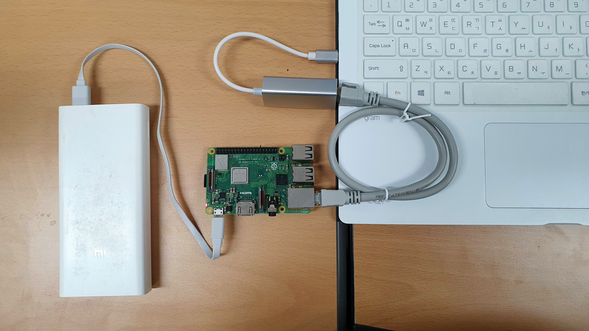

# Getting started with Pi

## How to set up your Pi

#### Install the Raspbian on your SD card

#### Step 1: Install the Pi OS on your SD card {-}
1. Download the [Raspberry Pi Imager](https://www.raspberrypi.com/software/) 

2. Plug in your SD card on your laptop.

3. Open the imager and format your SD card.  

3. Write the Raspberry Pi OS on your SD card. Please enable `ssh` and set username (pi) and password (raspberry) in the setting before the writing.  

#### Step 2: Connect the Pi on your laptop {-}
This enables your laptop to access and control your Pi via *a network cable*. We don't need to buy and use a screen, keyboard and mouse that can be attached to the Pi.

1. Plug in your SD card on the Pi and connect the Pi on your laptop via a Ethernet cable. 

2. 

3. 

4. 

<!--  -->

#### Step 2: Install the Raspbian on your SD card {-}

        
        
To manage your Raspberry Pi, you need to have a wired LAN or wireless LAN set up on your desktop. You can easily manage your Pi with remote control if your Pi is networked with your desktop.

### 

You should choose one of the many ways to manage Raspberry Pi
1. Use 

There are several ways to manage the Raspberry Pi 

        

