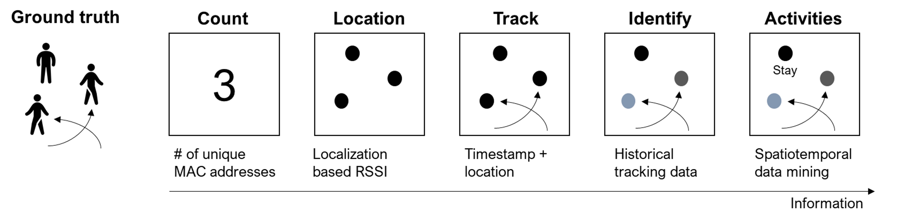

# WiFi Data Analysis
Using WiFi sensing technologies we identify five main metrics on pedestrian behaviors. Here is the figure illustrating the metrics.

 - Count: How many people are present?
 - Location – Where is that person?
 - Track – Where was the person before?
 - Identity – Who is the person?
 - Activities – What is the person doing?

The following sections cover how to generate the metrics. 
 

## Count

## Location

## Track

## Identify

## Activities

You can add parts to organize one or more book chapters together. Parts can be inserted at the top of an .Rmd file, before the first-level chapter heading in that same file. 

Add a numbered part: `# (PART) Act one {-}` (followed by `# A chapter`)

Add an unnumbered part: `# (PART\*) Act one {-}` (followed by `# A chapter`)

Add an appendix as a special kind of un-numbered part: `# (APPENDIX) Other stuff {-}` (followed by `# A chapter`). Chapters in an appendix are prepended with letters instead of numbers.

