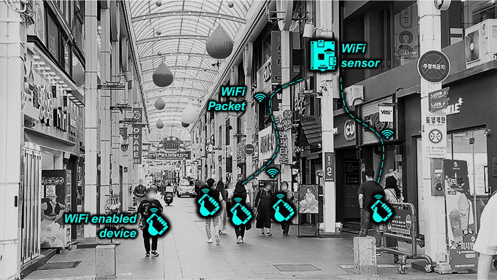

--- 
title: "How to Use Urban Smart Sensor"
author: "Juhyeon Park"
date: "`r Sys.Date()`"
site: bookdown::bookdown_site
documentclass: book
bibliography: [book.bib, packages.bib]
link-citations: yes
github-repo: rstudio/bookdown-demo
---

# Introduction

## About this document
This document provides useful information for individuals who are interested in **urban sensing** with commercially available lower-cost sensors. Many governments have launched a sensing project that involves a series of sensors placed around the city for capturing a massive amount of data including pedestrian, vehicle, temperature, and air quality. Here are some examples: the [Array of Things (AoT) in Chicago, USA](https://arrayofthings.github.io/) and [S-DoT in Seoul, Korea](https://github.com/seoul-iotdata/S-DoT_SampleData). With the rapid development of the Internet-of-Things (IoTs), the do-it-yourself (DIY) technologies attempt to democratize these monitoring practices that may be the domain of expert scientists. Our target audience are individuals who want to learn **how to build the urban DIY sensors**.

## Scope of this document
This document demonstrates 1) **how to build a smart sensor** that detects pedestrians outdoors through WiFi sensing and 2) **analyze the created data** to produce meaningful insights. This includes: 

  - Getting
  - WiFi data preprocessing
  - WiFi data analysis
  
### Why WiFi sensing?
**WiFi sensing technologies** is one of them as a non-invasive tool for *monitoring pedestrians* outdoor via sensors that detect WiFi packets sent regularly by access points (APs) and WiFi-enabled devices. Most pedestrians today carry smart devices equipped with WiFi network interfaces, and each WiFi packet includes unique 48-bit addresses, known as Media Access Control (MAC) addresses, enabling a device to be tracked by multiple WiFi sensors. Many recent papers used the sensing technologies to identify pedestrian movement and behaviors[^1][^2][^3].

[^1]: Duives, D. C., van Oijen, T., & Hoogendoorn, S. P. (2020). Enhancing Crowd Monitoring System Functionality through Data Fusion: Estimating Flow Rate from Wi-Fi Traces and Automated Counting System Data. Sensors (Basel), 20(21). https://doi.org/10.3390/s20216032
[^2]: Soundararaj, B., Cheshire, J., & Longley, P. (2019). Estimating real-time high-street footfall from Wi-Fi probe requests. International Journal of Geographical Information Science, 34(2), 325-343,. https://doi.org/10.1080/13658816.2019.1587616 
[^3]: Zhou, Y., Lau, B. P. L., Koh, Z., Yuen, C., & Ng, B. K. K. (2020). Understanding Crowd Behaviors in a Social Event by Passive WiFi Sensing and Data Mining. IEEE internet of things journal, 1-1,. https://doi.org/10.1109/jiot.2020.2972062 

